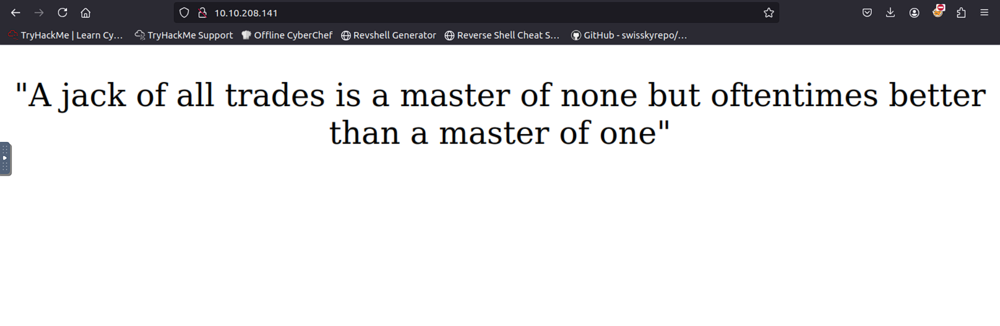
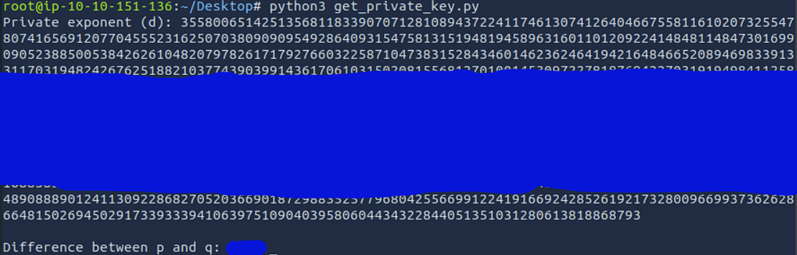

# Breaking RSA Writeup
This writeup is based on the [Breaking RSA](https://tryhackme.com/room/breakrsa) room over at TryHackMe.
## RSA Basics
RSA (Rivest–Shamir–Adleman) is a public-key cryptosystem, one of the oldest widely used for secure data transmission. RSA involves some parameter namely e(a constant), n(modulus), p and q(prime numbers).
## RSA Key Components

| Component | Description |
|-----------|-------------|
| **e** | A constant, usually `65537` |
| **n** | Known as the modulus of the public-private key pair. It is a product of `2` large random prime numbers, `p` and `q`. <br> `n = p × q` |
| **d** | A large positive integer that makes up the private key. It is calculated as: <br> ```d = modinv(e, lcm(p - 1, q - 1))``` <br> Where `modinv` is the modular inverse function and `lcm` is the least common multiple function. |


`(e, n)` are public variables and make up the public key. `d` is the private key and is calculated using `p` and `q`. If we could somehow factorize `n` into `p` and `q`, we could then be able to calculate d and break RSA. However, factorizing a large number is very difficult and would take some unrealistic amount of time to do so, provided the two prime numbers are **randomly** chosen.

In a recent analysis, it is found that an organization named JackFruit is using a deprecated cryptography library to generate their RSA keys. This library is known to implement RSA poorly. The two randomly selected prime numbers (`p` and `q`) are very close to one another, making it possible for an attacker to generate the private key from the public key using [Fermat's factorization algorithm](https://en.wikipedia.org/wiki/Fermat's_factorization_method).

## Enumeration
First let's find out which ports are open using `nmap`:

```console
nmap -sS -F 10.10.208.141
```


As usual we got port `80` opened. Let’s browse it now and see what will be get:




As evident, the home page doesn't offer anything noteworthy. Let's proceed to search for other existing paths or directories using `gobuster`.

```console
gobuster dir -u http://10.10.208.141/ -w /usr/share/wordlists/dirbuster/directory-list-2.3-medium.txt 
```


On the `/development` page, we find an RSA `public key` and a `log.txt`.


The log merely reiterates the information provided in the challenge description and points to the source of the algorithm. Additionally, we can infer that SSH is enabled for the `root` user. This means we already have the username we’ll need when generating the private key later to attempt SSH access.


From the challenge, we understand that we’re working with a weak RSA implementation. Our likely task will involve extracting *`N`* and *`e`* from the public key, factorizing *`N`* to obtain *`p`* and *`q`*, and then calculating *`d`*, which represents the private key. Once we have the parameters *`N`*, *`e`*, and *`d`*, we can generate the private SSH key, allowing us to gain access to the machine. For a quick overview of RSA, you can refer to this resource: [RSA (cryptosystem)](https://en.wikipedia.org/wiki/RSA_(cryptosystem)).

We download the public key `id_rsa.pub`.


## RSA analysis

To determine the length in bits of the public we can issue the following command:

```console
ssh-keygen -lf id_rsa.pub 
```


To extract the public key values from the `id_rsa.pub` file, we’ll use Python along with the `pycryptodome` library. Start by installing `pycryptodome` with the following command:

```console
pip install pycryptodome
```

```console
pip install gmpy2
```

To calculate *`n`* from the given public key, I created a small Python script to automate the process for us.

```python
from Crypto.PublicKey import RSA

key = RSA.importKey(open("id_rsa.pub").read())

print("Modulus (n):", key.n)
```


## Getting the private key

Finally, it’s time to apply Fermat’s factorization algorithm to derive *`p`* and *`q`*. Below is a possible Python implementation of the algorithm. Since *`n`* is quite large, the code utilizes the `gmpy2` package to handle the initial integer square root operation efficiently.

Below is an implementation of [Fermat's factorization algorithm](https://github.com/murtaza-u/zet/tree/main/20220808171808) in Python, ( From the Room ).
```python
#!/usr/bin/python3

from gmpy2 import isqrt

def factorize(n):
    # since even nos. are always divisible by 2, one of the factors will
    # always be 2
    if (n & 1) == 0:
        return (n/2, 2)

    # isqrt returns the integer square root of n
    a = isqrt(n)

    # if n is a perfect square the factors will be ( sqrt(n), sqrt(n) )
    if a * a == n:
        return a, a

    while True:
        a = a + 1
        bsq = a * a - n
        b = isqrt(bsq)
        if b * b == bsq:
            break

    return a + b, a - b

print(factorize(105327569)) # Replace this with N

```


Now that we know *`p`*, *`q`*, and *`e`* (which is typically `65537`), we can proceed to calculate the private key. Additionally, we can determine the difference between *`p`* and *`q`* to better understand the relationship between these prime factors.

```python
from math import gcd

def lcm(a, b):
    return abs(a * b) // gcd(a, b)

def mod_inverse(a, m):
    m0, x0, x1 = m, 0, 1
    while a > 1:
        q = a // m
        m, a = a % m, m
        x0, x1 = x1 - q * x0, x0
    return x1 + m0 if x1 < 0 else x1

def calculate_private_exponent(p, q, e):
    # Compute »(n) using LCM
    lambda_n = lcm(p - 1, q - 1)
    
    # Compute d (modular inverse of e mod »(n))
    d = mod_inverse(e, lambda_n)
    
    return d

p = # <Replace this with p>
q = # <Replace this with q>
e = 65537

d = calculate_private_exponent(p, q, e)
print("Private exponent (d):", d)

# Calculate the difference between p and q
difference = abs(p - q)
print("\nDifference between p and q:", difference)

```



Finally, we can use this script to construct the RSA key and export the private key in `.pem` format. This will allow us to use the private key to log in via SSH.

```python
from Crypto.PublicKey import RSA


n = # <Replace this with n>
e = 65537
d = # <Replace this with d>

# Construct the RSA key
key = RSA.construct((n, e, d))

# Export the private key
private_key_pem = key.export_key()

# Save to a file
with open("my_private_key.pem", "wb") as f:

    f.write(private_key_pem)

print("Private key saved as 'my_private_key.pem'")

```


Set appropriate permissions: Ensure the private key file (`my_private_key.pem`) has the correct permissions for security purposes. You can do this by running the following command:

```console
chmod 600  my_private_key.pem
```

## Accessing the system

Now that we got the private key we can try to SSH into the machine using the `root` user:

```console
ssh root@10.10.208.141 -i my_private_key.pem
```
Fantastic—that worked perfectly! Now that we have root privileges on this machine, we can proceed to access the flag and complete the challenge.


## Breaking RSA | Conclusion 

The TryHackMe "Breaking RSA" box offers an insightful dive into RSA security, highlighting the importance of protecting the modulus (*`n`*) from being factored into its prime components (*`p`* and *`q`*). If these factors are exposed, an attacker can derive the private key, compromising the encryption's integrity. Thankfully, modern cryptographic libraries employ advanced techniques to prevent such factorization attacks, ensuring RSA remains a reliable encryption standard. This reinforces RSA's role as a trusted method for secure communication and data protection in today's computing landscape.